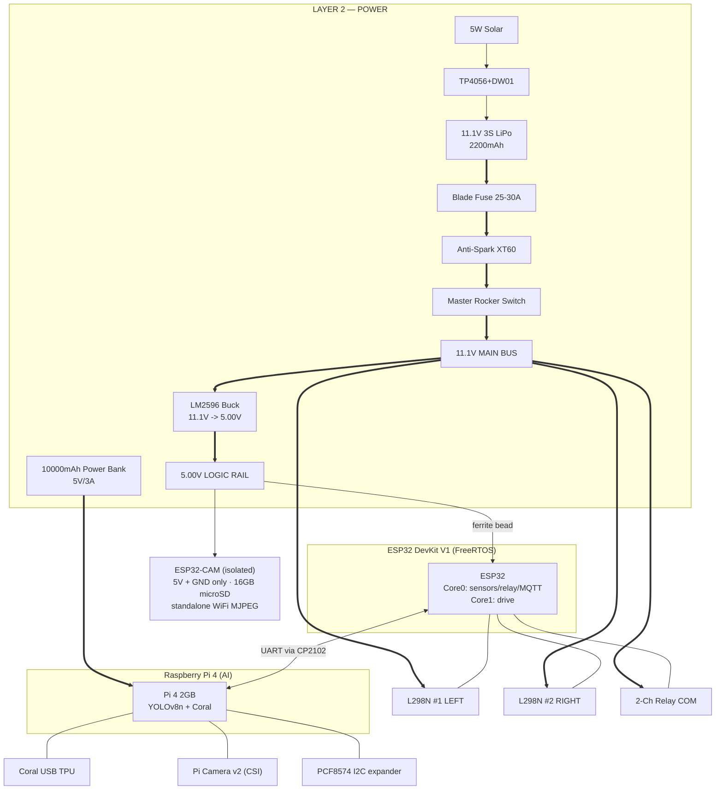
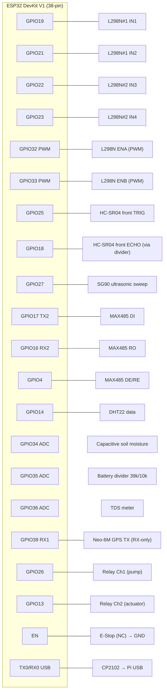
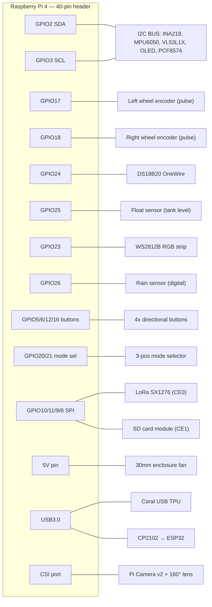

# AgriRover — Complete Circuit & Wiring Diagram

Dual-controller agricultural rover: **ESP32 DevKit V1** (real-time control) + **Raspberry Pi 4** (AI inference).
This document is the full electrical reference: power distribution, both pin maps, every bus, drive, actuation, and protection placement.

> Legend
> `===` high-current path (LiPo / motor) · `---` logic signal · `~~~` analog · `:::` I2C/serial bus
> All grounds are common (single star point at the LiPo negative bus — see §1).

---

## 0. System Architecture (block level)



---

## 1. Power Distribution Schematic (Layer 2)

Two **independent** 5V domains by design: motors+logic from the LiPo, and the Pi from its own power bank (eliminates buck ripple → Pi undervoltage throttling).

```
                          ┌─────────── SOLAR TRICKLE CHARGE ───────────┐
                          │  5W Solar(6V) ──► TP4056+DW01 ──► (charge)  │
                          └──────────────────────────────────┬─────────┘
                                                              │
  ┌────────┐   25-30A   ┌──────────┐   ┌────────┐   ┌─────────▼────────┐
  │ 3S LiPo│   BLADE    │Anti-Spark│   │ Rocker │   │   11.1V MAIN BUS │
  │ 11.1V  ├═══ FUSE ═══┤  XT60    ├═══┤ Switch ├═══┤ (screw terminals)│
  │ XT60   │            │(pre-chg) │   │  20A   │   └──┬───┬───┬───┬───┘
  └───┬────┘            └──────────┘   └────────┘      ║   ║   ║   ║
      │ (-)                                            ║   ║   ║   ║
      │                          ┌─────────────────────╝   ║   ║   ║
      │                          ║   ┌─────────────────────╝   ║   ║
      │                  ┌───────▼───────┐                     ║   ║
      │                  │  LM2596 BUCK  │            L298N#1◄══╝   ║
      │                  │ 11.1V → 5.00V │            L298N#2◄══════╝
      │                  │ (set w/ DMM)  │            Relay COM ◄═══ (12V loads)
      │                  └───────┬───────┘            P6KE15A TVS ── across bus
      │                          │ 5.00V LOGIC RAIL
      │     ┌────────┬───────────┼───────────┬──────────┬─────────┐
      │   [1000µF] [1000µF]   [ferrite]    HC-SR04   MAX485    sensors
      │     │        │            │ bead      VCC       VCC       VCC
      │    GND      GND      ┌─────▼─────┐
      │                      │ ESP32 VIN │
      │                      └───────────┘
      │
      │   ┌──────────────── SEPARATE PI DOMAIN ────────────────┐
      │   │ 10000mAh Power Bank ──(5V/3A USB-C)──► Pi 4 PWR IN  │
      │   └────────────────────────────────────────────────────┘
      │
   ╔══▼═══════════════════════════════════════════════════════════╗
   ║  COMMON GROUND STAR POINT  (LiPo (-) = buck GND = Pi GND =    ║
   ║  L298N GND = relay GND = all sensor GND = power bank GND)     ║
   ╚══════════════════════════════════════════════════════════════╝
```

**Protection placement (Layer 2 + gap items):**

| Item | Part | Placement | Purpose |
|------|------|-----------|---------|
| Fuse | Blade 25–30A | series, LiPo (+) before bus | fault-current cutoff (LiPo can dump 55A into a short) |
| Anti-spark | XT60 w/ pre-charge | LiPo → bus | limits inrush into 1000µF + L298N caps |
| TVS | P6KE15A ×2 | across 11.1V bus at L298N | clamps motor-reversal transients |
| Flyback | 1N5819 ×4 | across each motor terminal | clamps back-EMF on motor stop |
| Bulk | 1000µF 16V ×2 | across 5V rail | absorbs WiFi/servo current spikes |
| Ferrite bead | series | 5V into ESP32 VIN | blocks HF motor noise → prevents brownout |
| Monitor | INA219 | LiPo via divider → Pi I2C | SoC tracking, EVT_LOW_BATTERY |
| Divider | 39k/10k | LiPo → ESP32 Pin35 | firmware battery % (see §7) |

---

## 2. ESP32 DevKit V1 — Complete Pin Map



### ESP32 connection table (every pin)

| ESP32 Pin | Net | Connects To | Type | Notes |
|-----------|-----|-------------|------|-------|
| GPIO19 | IN1 | L298N #1 IN1 | OUT | left motor dir |
| GPIO21 | IN2 | L298N #1 IN2 | OUT | left motor dir |
| GPIO22 | IN3 | L298N #2 IN3 | OUT | right motor dir |
| GPIO23 | IN4 | L298N #2 IN4 | OUT | right motor dir |
| GPIO32 | ENA | L298N ENA (both, or per-side) | PWM (LEDC) | left speed |
| GPIO33 | ENB | L298N ENB | PWM (LEDC) | right speed |
| GPIO25 | TRIG | HC-SR04 front TRIG | OUT | 3.3V trigger OK |
| GPIO18 | ECHO | HC-SR04 front ECHO | IN | **via 2.2k/3.9k divider → 3.2V** |
| GPIO27 | SERVO | SG90 ultrasonic mount signal | PWM | 180° sweep |
| GPIO17 | TX2/DI | MAX485 DI | UART2 TX | NPK probe |
| GPIO16 | RX2/RO | MAX485 RO | UART2 RX | NPK probe |
| GPIO4  | DE/RE | MAX485 DE+RE (tied) | OUT | toggle before/after Modbus frame |
| GPIO14 | DHT | DHT22 data | IN/OUT | 10k pull-up to 3.3V |
| GPIO34 | A_MOIST | Capacitive moisture AOUT | ADC1_CH6 | input-only pin |
| GPIO35 | A_VBAT | Battery divider tap | ADC1_CH7 | input-only; 2.57V @12.6V |
| GPIO36 | A_TDS | TDS meter AOUT | ADC1_CH0 | input-only pin |
| GPIO39 | GPS_RX | Neo-6M TX | UART1 RX | receive-only |
| GPIO26 | RLY1 | Relay Ch1 (pump) | OUT | active per module logic |
| GPIO13 | RLY2 | Relay Ch2 (actuator) | OUT | sequenced after Ch1 |
| EN | E-STOP | E-Stop NC → GND | RST | pulls EN low = halt |
| TX0/RX0 | USB | CP2102 → Pi | UART0 | AI command link |
| 3V3 | 3.3V | DHT pull-up, dividers top ref | PWR | |
| VIN | 5V | from 5V rail **via ferrite bead** | PWR | |
| GND | GND | common star ground | PWR | |

> **ESP32 is fully allocated.** Any new control line (e.g. actuator DPDT direction in Branch B) requires reclaiming a pin or adding an I2C expander on the ESP32's *own* bus — do not route time-critical dosing through the Pi's PCF8574.

---

## 2.5. ESP32-CAM (isolated teleop / waypoint camera, BOM #2 + #5)

Per the BOM the ESP32-CAM is **isolated from the main ESP32's data lines** — it shares only power and ground and runs its own WiFi stack. No UART/SPI/I2C link to the main MCU.

```
5.00V RAIL ──┬──► ESP32-CAM 5V   (keep feed SHORT; brownout is the #1 failure mode)
             └─[470µF + 100nF local]   absorbs WiFi-TX current bursts
GND ────────────► ESP32-CAM GND   (common star ground, §1)
[16GB microSD #5] ► onboard slot   timestamped photo per seeding waypoint
WiFi (independent) ► MJPEG teleop stream + dashboard tile
```

| ESP32-CAM Pin | Connects To | Notes |
|---------------|-------------|-------|
| 5V | 5.00V logic rail | local 470µF + 100nF decoupling mandatory |
| GND | common star ground | |
| microSD slot | 16GB Class-10 card (#5) | field photo archive, named by timestamp + GPS |
| U0R / U0T + GPIO0→GND | CP2102/FTDI (flash only) | jumper GPIO0→GND to program, remove to run |

> Flashing note: the ESP32-CAM has no onboard USB. Program it with the CP2102 (or an FTDI) only during firmware upload; it is not wired to the main ESP32 in normal operation.

---

## 3. Raspberry Pi 4 — GPIO Map + Conflict Audit



### Pi connection table

| Pi Pin | Net | Connects To | Bus | Notes |
|--------|-----|-------------|-----|-------|
| GPIO2 (SDA) | I2C-SDA | INA219, MPU6050, VL53L1X, OLED, PCF8574 | I2C | **add 4.7k pull-up to 3.3V** |
| GPIO3 (SCL) | I2C-SCL | (same bus) | I2C | **add 4.7k pull-up to 3.3V** |
| GPIO17 | ENC_L | Left Hall encoder pulse | pulse | one channel per side for velocity |
| GPIO18 | ENC_R | Right Hall encoder pulse | pulse | conflict resolved (rain moved to 26) |
| GPIO24 | OW | DS18B20 data | OneWire | **4.7k pull-up mandatory** |
| GPIO25 | FLOAT | Tank float sensor | digital | conflict resolved (LoRa CS → CE1) |
| GPIO26 | RAIN | Rain sensor digital out | digital | relocated off GPIO18 |
| GPIO23 | WS_DIN | WS2812B data-in | digital | level-shift to 5V recommended |
| GPIO5/6/12/16 | BTN_U/D/L/R | 4× directional buttons (#61) | digital | 10k pull-ups, GND on press |
| GPIO20/21 | MODE_A/B | 3-pos mode selector (#60) | digital | 2 lines encode AUTO/MANUAL/SCAN |
| GPIO8 (CE0) | LoRa_NSS | LoRa SX1276 chip-select | SPI | |
| GPIO7 (CE1) | SD_CS | SD card module chip-select | SPI | |
| GPIO10/9/11 | SPI0 | MOSI/MISO/SCLK shared | SPI | LoRa + SD share the bus |
| 5V | FAN+ | 30mm fan (0.1A) | PWR | from power-bank-fed 5V |
| USB3.0 | — | Coral TPU | USB | dedicated bandwidth |
| USB | — | CP2102 → ESP32 | USB | UART bridge |
| CSI | — | Pi Camera v2 (30cm ribbon) | CSI | wide-angle M12 lens |
| microSD | — | 32GB Class-10 (#4) | — | Pi OS + model files + logs |
| GND | GND | common star ground | PWR | tie to LiPo (-) |

> Mode selector (#60): a 3-position rotary read as 2 digital lines with pull-ups — position 1 grounds GPIO20, position 3 grounds GPIO21, position 2 grounds neither. Read on boot to set the FreeRTOS initial state, then poll for live changes.

### ⚠ Pin conflicts in the original BOM — RESOLVED in this diagram

| Conflict | Components fighting for it | Resolution applied |
|----------|--------------------------|--------------------|
| **GPIO18** | right encoder **and** rain sensor **and** rear HC-SR04 | encoder keeps GPIO18; rain → **GPIO26**; rear HC-SR04 → **PCF8574 P3/P4** |
| **GPIO25** | tank float sensor **and** LoRa CS | float keeps GPIO25; LoRa CS → **CE0/GPIO8**, SD CS → **CE1/GPIO7** |
| I2C loading | 5 devices on one bus | external **4.7k pull-ups** (gap #11) — internal pull-ups too weak at this capacitance |
| Mode sel / buttons | unassigned in BOM | mode sel → **GPIO20/21**; buttons → **GPIO5/6/12/16** |

---

## 4. Shared Buses

### 4.1 I2C bus (Pi side)
```
3.3V ──[4.7k]──┬───────┬───────┬───────┬───────┬─── SDA (GPIO2)
3.3V ──[4.7k]──┼──┬────┼──┬────┼──┬────┼──┬────┼──┬ SCL (GPIO3)
               │  │    │  │    │  │    │  │    │  │
            INA219  MPU6050  VL53L1X  SSD1306  PCF8574
            0x40    0x68     0x29     0x3C     0x20
```
Each device: 100nF decoupling cap across its VCC–GND, within 5mm of the chip (gap item #12).

### 4.2 RS485 — NPK probe (ESP32 UART2)
```
ESP32 GPIO17 (TX2/DI) ──► MAX485 DI ┐
ESP32 GPIO16 (RX2/RO) ◄── MAX485 RO ┤   A ──────► NPK probe A
ESP32 GPIO4  (DE/RE) ───► DE+RE tied┘   B ──────► NPK probe B
                                        (half-duplex, 9600 8N1, Modbus RTU)
Sequence: set DE/RE HIGH → send 8-byte query → set DE/RE LOW → read response.
```

### 4.3 SPI (Pi side) — LoRa + SD module
```
GPIO11 SCLK ─┬─ LoRa SCK   ── SD SCK
GPIO10 MOSI ─┼─ LoRa MOSI  ── SD MOSI
GPIO9  MISO ─┼─ LoRa MISO  ── SD MISO
GPIO8  CE0  ─── LoRa NSS
GPIO7  CE1  ─── SD CS        (separate CS per device)
LoRa SX1276 SMA ──► 868MHz 3dBi antenna
```

### 4.4 Inter-controller UART (the AI link)
```
Pi USB ──► CP2102 ──► ESP32 UART0 (TX0/RX0)
Pi → ESP32:  STOP, RESUME, LEFT, RIGHT, SPRAY_ON, SPRAY_OFF, PAUSE_IRRIGATION,
             EVT_TILT_HALT, PUMP_DISABLE
ESP32 → Pi:  sensor_ack, gps_coords, battery_pct, mode_status, rover_velocity_mm_per_s
```

---

## 5. Motor Drive, Relay Sequencing & Expander

### 5.1 Four-wheel tank drive (2× L298N)
```
        11.1V BUS ═══════════════╦═══════════════════╗
                                 ║ +12V              ║ +12V
                        ┌────────▼────────┐  ┌────────▼────────┐
   ESP32 IN1/IN2/ENA ──►│   L298N #1 LEFT │  │ L298N #2 RIGHT  │◄── IN3/IN4/ENB
                        │ [14mm heatsink] │  │ [14mm heatsink] │
                        └──┬───────────┬──┘  └──┬───────────┬──┘
                       OUT1│          OUT2     OUT3         OUT4
                           │           │        │           │
                      ┌────▼──┐   ┌────▼──┐ ┌───▼───┐  ┌────▼──┐
                      │MotorFL│   │MotorRL│ │MotorFR│  │MotorRR│   (1N5819 across
                      └───────┘   └───────┘ └───────┘  └───────┘    each terminal)
   Encoders on RL & RR axles ──► Pi GPIO17/18
```
ENA/ENB driven by ESP32 LEDC PWM (NOT jumpered high) — required for velocity → seed-drop offset.

### 5.2 Relay-driven actuation (dosing sequence)
```
ESP32 GPIO26 ──► Relay Ch1 ──► COM=11.1V ──► 12V Submersible/Peristaltic Pump
ESP32 GPIO13 ──► Relay Ch2 ──► COM=11.1V ──► 12V Linear Actuator (150N, limit sw)

Sequence (Core 0, never simultaneous):
  Ch1 ON 1.5s (pre-soak) → Ch1 OFF → Ch2 ON (extend→limit) → dose → Ch2 OFF (retract)
```
> **OPEN ITEM — actuator retraction:** Branch A (spring-return) = above scheme works as-is.
> Branch B (DC reversible) = add **DPDT relay** for polarity + 1 control line; let built-in limit switches end travel.

### 5.3 PCF8574 expander (offloads Pi outputs)
```
Pi I2C (0x20) ──► PCF8574 ──┬─ P0 → Grass-cutter relay (12V 775 motor)
                            ├─ P1 → Misting/herbicide relay
                            ├─ P2 → Seed-sower SG90 servo enable
                            ├─ P3 → Rear HC-SR04 TRIG
                            └─ P4 → Rear HC-SR04 ECHO (via divider)
```

---

## 6. Analog Detail Circuits (exact resistor values)

### 6.1 HC-SR04 ECHO level shift (5V → 3.2V)
```
ECHO(5V) ──[2.2kΩ]──┬── ESP32 GPIO18
                    │
                 [3.9kΩ]
                    │
                   GND
   Vout = 5 × 3.9/(2.2+3.9) = 3.2V  ✓ (< 3.3V max)
```

### 6.2 Battery sense divider (12.6V → 2.57V)
```
LiPo+ (12.6V max) ──[39kΩ]──┬── ESP32 GPIO35 (ADC1_CH7)
                            │
                         [10kΩ]
                            │
                           GND
   Vout = 12.6 × 10/(39+10) = 2.57V  ✓  (firmware maps to LiPo discharge curve)
```

### 6.3 DHT22 / DS18B20 / button pull-ups
```
DHT22:   3.3V ─[10kΩ]─ data(GPIO14)
DS18B20: 3.3V ─[4.7kΩ]─ data(Pi GPIO24)     (mandatory)
Buttons: 3.3V ─[10kΩ]─ button ─ Pi GPIO ─ GND on press
```

---

## 7. Build / Wiring Checklist (electrical safety order)

1. Set LM2596 to **exactly 5.00V with a multimeter BEFORE** connecting ESP32.
2. Install blade fuse + anti-spark XT60 + rocker switch on LiPo (+) **first**.
3. Establish the **common ground star point** before any signal wiring.
4. Place 1N5819 flyback on every motor; P6KE15A TVS on the bus.
5. Ferrite bead on ESP32 VIN; 1000µF on 5V rail; 100nF at each IC (within 5mm).
6. External 4.7k I2C pull-ups; resolve GPIO18 / GPIO25 conflicts (§3).
7. Pi powered ONLY from the 10000mAh bank — never the buck rail.
8. Confirm actuator type → finalize Ch2 / DPDT wiring (§5.2).
9. Cable glands + RTV at every enclosure pass-through; grommets on acrylic holes.
10. Loctite 243 (blue) on all M3/M4 after final alignment; conformal-coat PCBs.

---

## 8. Full BOM Coverage Matrix (verification — every component accounted for)

Status: **E** = electrically wired in this diagram · **M** = mechanical/consumable (no wiring) · **B** = bench equipment (off-rover).

### Layer 1 — Brain & Compute
| # | Component | Status | Where in diagram |
|---|-----------|--------|------------------|
| 1 | ESP32 DevKit V1 | E | §2 full pin map |
| 2 | ESP32-CAM | E | §0, §2.5 (isolated, 5V+GND+microSD) |
| 3 | Raspberry Pi 4 | E | §3 full pin map |
| 4 | 32GB microSD (Pi) | E | §3 table (Pi SD slot) |
| 5 | 16GB microSD (CAM) | E | §2.5 (ESP32-CAM slot) |
| 6 | CP2102 USB-Serial | E | §0, §4.4 inter-controller UART |

### Layer 2 — Power
| # | Component | Status | Where |
|---|-----------|--------|-------|
| 7 | 3S LiPo | E | §1 |
| 8 | LM2596 buck | E | §1 (5.00V rail) |
| 9 | Power bank | E | §1 (separate Pi domain) |
| 10 | INA219 | E | §1, §4.1 I2C 0x40 |
| 11 | 1000µF cap ×2 | E | §1 protection table |
| 12 | 1N5819 ×4 | E | §1, §5.1 (across motors) |
| 13 | P6KE15A TVS ×2 | E | §1 (across bus) |
| 14 | XT60 pair | E | §1 |
| 15 | Rocker switch | E | §1 |
| 16 | 39k/10k divider | E | §6.2 |
| 17 | 5W solar | E | §1 (trickle charge) |
| 18 | TP4056+DW01 | E | §1 |
| 19 | Velcro/battery tray | M | chassis ballast — no wiring |

### Layer 3 — Motor & Drive
| # | Component | Status | Where |
|---|-----------|--------|-------|
| 20 | 12V gear motor ×4 | E | §5.1 |
| 21 | L298N ×2 | E | §2, §5.1 |
| 22 | Hall encoder ×2 | E | §3 (GPIO17/18) |
| 23 | Encoder magnet disc | M | pressed on shaft |
| 24 | Rubber wheels | M | — |
| 25 | Motor mounts | M | — |

### Layer 4 — Sensing (ESP32)
| # | Component | Status | Where |
|---|-----------|--------|-------|
| 26 | HC-SR04 front | E | §2 (TRIG25/ECHO18), §6.1 |
| 27 | HC-SR04 rear | E | §5.3 PCF8574 P3/P4 |
| 28 | SG90 (ultrasonic) | E | §2 GPIO27 |
| 29 | Capacitive moisture | E | §2 GPIO34 |
| 30 | RS485 NPK probe | E | §4.2 |
| 31 | MAX485 | E | §2, §4.2 |
| 32 | DHT22 | E | §2 GPIO14, §6.3 |
| 33 | DS18B20 | E | §3 GPIO24, §6.3 |
| 34 | TDS meter | E | §2 GPIO36 |
| 35 | Rain sensor | E | §3 GPIO26 (relocated) |
| 36 | MPU6050 | E | §4.1 I2C 0x68 |
| 37 | Neo-6M GPS | E | §2 GPIO39 (RX-only) |
| 38 | VL53L1X ToF | E | §4.1 I2C 0x29 |

### Layer 5 — AI Sensing (Pi)
| # | Component | Status | Where |
|---|-----------|--------|-------|
| 39 | Pi Camera v2 | E | §3 CSI |
| 40 | 160° M12 lens | M | on camera |
| 41 | Coral USB TPU | E | §3 USB3.0 |
| 42 | CSI ribbon 30cm | E | §3 CSI |
| 43 | GPIO ext header | M | passive breakout |

### Layer 6 — Actuation & Output
| # | Component | Status | Where |
|---|-----------|--------|-------|
| 44 | Linear actuator | E | §5.2 Relay Ch2 |
| 45 | Submersible pump | E | §5.2 Relay Ch1 |
| 46 | 2-ch relay | E | §2, §5.2 |
| 47 | Peristaltic pump (opt) | E | §5.2 (Ch1 alt) |
| 48 | Grass cutter motor | E | §5.3 PCF8574 P0 |
| 49 | SG90 seed sower | E | §5.3 PCF8574 P2 |
| 50 | Misting nozzle | E | §5.3 PCF8574 P1 (relay) |
| 51 | Water tank | M | reservoir |
| 52 | Float sensor | E | §3 GPIO25 |
| 53 | Silicone tubing | M | "floppy tube fix" |
| 54 | PCF8574 | E | §4.1, §5.3 I2C 0x20 |

### Layer 7 — Communication
| # | Component | Status | Where |
|---|-----------|--------|-------|
| 55 | LoRa SX1276 | E | §4.3 SPI CE0 |
| 56 | 868MHz antenna | E | §4.3 |

### Layer 8 — Interface & Monitoring
| # | Component | Status | Where |
|---|-----------|--------|-------|
| 57 | OLED SSD1306 | E | §4.1 I2C 0x3C |
| 58 | WS2812B strip | E | §3 GPIO23 |
| 59 | E-stop | E | §2 EN pin |
| 60 | Mode selector | E | §3 GPIO20/21 |
| 61 | 4× buttons | E | §3 GPIO5/6/12/16 |
| 62 | SD card module | E | §4.3 SPI CE1 |

### Layer 9 — Passives & Wiring
| # | Component | Status | Where |
|---|-----------|--------|-------|
| 63 | 2.2kΩ ×5 | E | §6.1 |
| 64 | 3.9kΩ ×5 | E | §6.1 |
| 65 | 39kΩ ×2 | E | §6.2 |
| 66 | 10kΩ ×5 | E | §6.2/6.3 |
| 67 | 4.7kΩ ×2 | E | §6.3 / §4.1 |
| 68 | 100nF ×10 | E | §4.1 (per-IC, within 5mm) |
| 69 | 10µF ×5 | E | sensor supply decoupling |
| 70 | 22AWG wire | M | power runs |
| 71 | 26AWG ribbon | M | harness |
| 72 | JST-PH conns | M | detachable joints |
| 73 | Screw terminals | E | §1 bus distribution |
| 74 | Perfboard ×2 | M | mounting substrate |
| 75 | Heat shrink | M | joint protection |
| 76 | Zip ties | M | cable mgmt / tube anchor |

### Layers 10–11 — Chassis & Attachments
| # | Components | Status | Note |
|---|-----------|--------|------|
| 77–84 | Acrylic, aluminum, fasteners, standoffs, PETG, sealing, clear coat | M | mechanical structure |
| 85–90 | Grass cutter housing, seed funnel, weeder bracket, NPK mount, cam housing, enclosure lid | M | 3D-printed; house electrical parts wired elsewhere |

### Layer 12 — Software
| # | Items | Status | Note |
|---|-------|--------|------|
| 91–110 | FreeRTOS, PlatformIO, Pi OS, Python, OpenCV, TFLite, YOLOv8n, PyCoral, datasets, Mosquitto, Pathway, Streamlit, Folium, Node-RED, Telegram, PySerial, paho-mqtt, TinyGPS++, Colab | — | not circuit elements (target of project scaffold) |

### Gap-audit items (15)
| # | Item | Status | Where |
|---|------|--------|-------|
| G1 | Blade fuse 25–30A | E | §1 |
| G2 | Anti-spark XT60 | E | §1 |
| G3 | LiPo balance charger | B | bench, off-rover |
| G4 | L298N heatsinks ×2 | E/M | §5.1 (on IC) |
| G5 | Pi heatsink kit | M | thermal |
| G6 | 30mm fan | E | §3 (Pi 5V) |
| G7 | Loctite 243 | M | §7 step 10 |
| G8 | Conformal coat | M | §7 step 10 |
| G9 | Cable glands | M | §7 step 9 |
| G10 | RTV sealant | M | §7 step 9 |
| G11 | I2C pull-ups 4.7k | E | §4.1 |
| G12 | 100nF decoupling | E | §4.1 placement rule |
| G13 | Ferrite bead | E | §1, §2 (ESP32 VIN) |
| G14 | Rubber grommets | M | §7 step 9 |
| G15 | Nylon trimmer line | M | grass cutter consumable |

**Result: all 110 BOM components + 15 gap items accounted for.** Every electrical item (E) has a pin/bus assignment; mechanical (M) and bench (B) items are noted where they intersect the electrical build. The only remaining decision is the actuator retraction type (§5.2), which is a parts/wiring branch, not a missing component.
