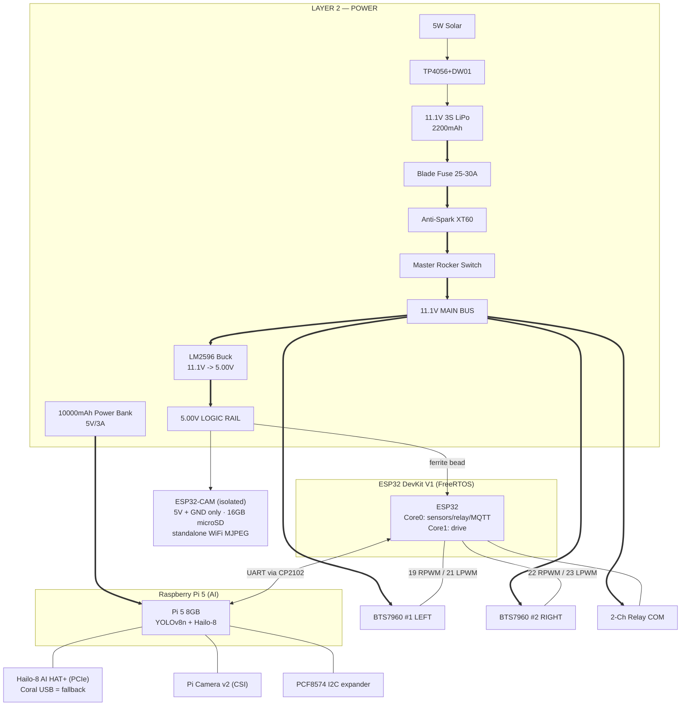
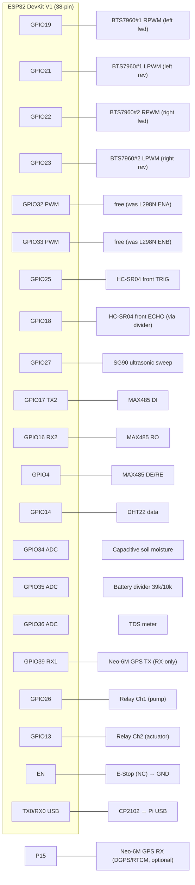
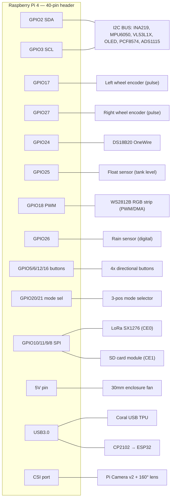

# AgriRover — Complete Circuit & Wiring Diagram

Dual-controller agricultural rover: **ESP32 DevKit V1** (real-time control) + **Raspberry Pi 5 + Hailo-8 AI HAT+** (AI inference; Pi 4 + Coral USB is the documented fallback).
This document is the full electrical reference: power distribution, both pin maps, every bus, drive, actuation, and protection placement.

> **Battery-chemistry scope:** the voltages drawn below (11.1 V bus, 12.6 V max,
> 2.57 V divider tap, P6KE15A TVS, 16 V caps) describe the original **3S LiPo
> bench prototype**. The **funded field build uses a 4S LiFePO4 pack** — see the
> BOM (#13), `firmware/include/config.h` (14.6 V full / 12.8 V nominal / 11.0 V
> cutoff), and `pi/sensors/fuel_gauge.py`. For the LiFePO4 bus apply these
> deltas: bus/nominal ≈ 12.8 V (14.6 V charged), TVS → **P6KE20A**, bulk caps →
> **25 V**, and the §6.2 divider maps to the LiFePO4 curve (14.6 V → 2.98 V tap).
>
> Legend
> `===` high-current path (LiPo / motor) · `---` logic signal · `~~~` analog · `:::` I2C/serial bus
> All grounds are common (single star point at the LiPo negative bus — see §1).

---

## 0. System Architecture (block level)



---

## 1. Power Distribution Schematic (Layer 2)

Two **independent** 5V domains by design: motors+logic from the LiPo, and the Pi from its own power bank (eliminates buck ripple → Pi undervoltage throttling).

```
                          ┌─────────── SOLAR TRICKLE CHARGE ───────────┐
                          │  5W Solar(6V) ──► TP4056+DW01 ──► (charge)  │
                          └──────────────────────────────────┬─────────┘
                                                              │
  ┌────────┐   25-30A   ┌──────────┐   ┌────────┐   ┌─────────▼────────┐
  │ 3S LiPo│   BLADE    │Anti-Spark│   │ Rocker │   │   11.1V MAIN BUS │
  │ 11.1V  ├═══ FUSE ═══┤  XT60    ├═══┤ Switch ├═══┤ (screw terminals)│
  │ XT60   │            │(pre-chg) │   │  20A   │   └──┬───┬───┬───┬───┘
  └───┬────┘            └──────────┘   └────────┘      ║   ║   ║   ║
      │ (-)                                            ║   ║   ║   ║
      │                          ┌─────────────────────╝   ║   ║   ║
      │                          ║   ┌─────────────────────╝   ║   ║
      │                  ┌───────▼───────┐                     ║   ║
      │                  │  LM2596 BUCK  │            BTS7960#1◄╝   ║
      │                  │ 11.1V → 5.00V │            BTS7960#2◄════╝
      │                  │ (set w/ DMM)  │            Relay COM ◄═══ (12V loads)
      │                  └───────┬───────┘            P6KE15A TVS ── across bus
      │                          │ 5.00V LOGIC RAIL
      │     ┌────────┬───────────┼───────────┬──────────┬─────────┐
      │   [1000µF] [1000µF]   [ferrite]    HC-SR04   MAX485    sensors
      │     │        │            │ bead      VCC       VCC       VCC
      │    GND      GND      ┌─────▼─────┐
      │                      │ ESP32 VIN │
      │                      └───────────┘
      │
      │   ┌──────────────── SEPARATE PI DOMAIN ────────────────┐
      │   │ Power Bank ──(5V/5A USB-C PD)──► Pi 5 + Hailo HAT   │
      │   │  (Pi 5+Hailo needs 5V/5A; Pi 4+Coral = 5V/3A ok)   │
      │   └────────────────────────────────────────────────────┘
      │
   ╔══▼═══════════════════════════════════════════════════════════╗
   ║  COMMON GROUND STAR POINT  (LiPo (-) = buck GND = Pi GND =    ║
   ║  BTS7960 GND = relay GND = all sensor GND = power bank GND)   ║
   ╚══════════════════════════════════════════════════════════════╝
```

**Protection placement (Layer 2 + gap items):**

| Item | Part | Placement | Purpose |
|------|------|-----------|---------|
| Fuse | Blade 25–30A | series, LiPo (+) before bus | fault-current cutoff (LiPo can dump 55A into a short) |
| Anti-spark | XT60 w/ pre-charge | LiPo → bus | limits inrush into 1000µF + BTS7960 caps |
| TVS | P6KE15A ×2 | across 11.1V bus at BTS7960 | clamps motor-reversal transients |
| Flyback | 1N5819 ×4 | across each motor terminal | clamps back-EMF on motor stop |
| Bulk | 1000µF 16V ×2 | across 5V rail | absorbs WiFi/servo current spikes |
| Ferrite bead | series | 5V into ESP32 VIN | blocks HF motor noise → prevents brownout |
| Monitor | INA219 | LiPo via divider → Pi I2C | SoC tracking, EVT_LOW_BATTERY |
| Divider | 39k/10k | LiPo → ESP32 Pin35 | firmware battery % (see §7) |

---

## 2. ESP32 DevKit V1 — Complete Pin Map



### ESP32 connection table (every pin)

| ESP32 Pin | Net | Connects To | Type | Notes |
|-----------|-----|-------------|------|-------|
| GPIO19 | L_RPWM | BTS7960 #1 RPWM | PWM (LEDC) | left forward |
| GPIO21 | L_LPWM | BTS7960 #1 LPWM | PWM (LEDC) | left reverse |
| GPIO22 | R_RPWM | BTS7960 #2 RPWM | PWM (LEDC) | right forward |
| GPIO23 | R_LPWM | BTS7960 #2 LPWM | PWM (LEDC) | right reverse |
| GPIO32 | — | free (was L298N ENA) | — | BTS7960 R_EN/L_EN tied to 3.3V |
| GPIO33 | — | free (was L298N ENB) | — | reclaimable; optional EN drive |
| GPIO25 | TRIG | HC-SR04 front TRIG | OUT | 3.3V trigger OK |
| GPIO18 | ECHO | HC-SR04 front ECHO | IN | **via 2.2k/3.9k divider → 3.2V** |
| GPIO27 | SERVO | SG90 ultrasonic mount signal | PWM | 180° sweep |
| GPIO17 | TX2/DI | MAX485 DI | UART2 TX | NPK probe |
| GPIO16 | RX2/RO | MAX485 RO | UART2 RX | NPK probe |
| GPIO4  | DE/RE | MAX485 DE+RE (tied) | OUT | toggle before/after Modbus frame |
| GPIO14 | DHT | DHT22 data | IN/OUT | 10k pull-up to 3.3V |
| GPIO34 | A_MOIST | Capacitive moisture AOUT | ADC1_CH6 | input-only pin |
| GPIO35 | A_VBAT | Battery divider tap | ADC1_CH7 | input-only; 2.57V @12.6V |
| GPIO36 | A_TDS | TDS meter AOUT | ADC1_CH0 | input-only pin |
| GPIO39 | GPS_RX | Neo-6M TX | UART1 RX | receive-only |
| GPIO15 | GPS_TX | Neo-6M RX | UART1 TX | DGPS/RTCM injection (optional); strapping-safe (idles HIGH) |
| GPIO26 | RLY1 | Relay Ch1 (pump) | OUT | active per module logic |
| GPIO13 | RLY2 | Relay Ch2 (actuator) | OUT | sequenced after Ch1 |
| GPIO2 | ACT_DIR | DPDT direction (Branch B only) | OUT | FC-03, idle unless `ACTUATOR_DC_REVERSIBLE=1` |
| EN | E-STOP | E-Stop NC → GND | RST | pulls EN low = halt |
| TX0/RX0 | USB | CP2102 → Pi | UART0 | AI command link |
| 3V3 | 3.3V | DHT pull-up, dividers top ref | PWR | |
| VIN | 5V | from 5V rail **via ferrite bead** | PWR | |
| GND | GND | common star ground | PWR | |

> **ESP32 drive pins freed by the BTS7960 swap.** Moving to dual-PWM BTS7960
> drivers releases GPIO32/33 (the old L298N ENA/ENB). Branch B's actuator DPDT
> direction line now uses **GPIO2** (a strapping pin left free); GPIO32/33 remain
> available for future control lines. Do not route time-critical dosing through
> the Pi's PCF8574.

---

## 2.5. ESP32-CAM (isolated teleop / waypoint camera, BOM #2 + #5)

Per the BOM the ESP32-CAM is **isolated from the main ESP32's data lines** — it shares only power and ground and runs its own WiFi stack. No UART/SPI/I2C link to the main MCU.

```
5.00V RAIL ──┬──► ESP32-CAM 5V   (keep feed SHORT; brownout is the #1 failure mode)
             └─[470µF + 100nF local]   absorbs WiFi-TX current bursts
GND ────────────► ESP32-CAM GND   (common star ground, §1)
[16GB microSD #5] ► onboard slot   timestamped photo per seeding waypoint
WiFi (independent) ► MJPEG teleop stream + dashboard tile
```

| ESP32-CAM Pin | Connects To | Notes |
|---------------|-------------|-------|
| 5V | 5.00V logic rail | local 470µF + 100nF decoupling mandatory |
| GND | common star ground | |
| microSD slot | 16GB Class-10 card (#5) | field photo archive, named by timestamp + GPS |
| U0R / U0T + GPIO0→GND | CP2102/FTDI (flash only) | jumper GPIO0→GND to program, remove to run |

> Flashing note: the ESP32-CAM has no onboard USB. Program it with the CP2102 (or an FTDI) only during firmware upload; it is not wired to the main ESP32 in normal operation.

---

## 3. Raspberry Pi 4 — GPIO Map + Conflict Audit



### Pi connection table

| Pi Pin | Net | Connects To | Bus | Notes |
|--------|-----|-------------|-----|-------|
| GPIO2 (SDA) | I2C-SDA | INA219, MPU6050, VL53L1X, OLED, PCF8574, ADS1115 | I2C | **add 4.7k pull-up to 3.3V** |
| GPIO3 (SCL) | I2C-SCL | (same bus) | I2C | **add 4.7k pull-up to 3.3V** |
| GPIO17 | ENC_L | Left Hall encoder pulse | pulse | one channel per side for velocity |
| GPIO27 | ENC_R | Right Hall encoder pulse | pulse | moved off GPIO18 (see §9.6) |
| GPIO24 | OW | DS18B20 data | OneWire | **4.7k pull-up mandatory** |
| GPIO25 | FLOAT | Tank float sensor | digital | conflict resolved (LoRa CS → CE0) |
| GPIO26 | RAIN | Rain sensor digital out | digital | relocated off GPIO18 |
| GPIO18 | WS_DIN | WS2812B data-in (PWM/DMA) | digital | required by rpi_ws281x; level-shift 3.3V→5V |
| GPIO5/6/12/16 | BTN_U/D/L/R | 4× directional buttons (#61) | digital | 10k pull-ups, GND on press |
| GPIO20/21 | MODE_A/B | 3-pos mode selector (#60) | digital | 2 lines encode AUTO/MANUAL/SCAN |
| GPIO13 | SERVO_PAN | Pan SG90 (aimed spray, FC-01) | PWM | hardware-PWM (PWM1); nozzle lateral aim |
| GPIO19 | SERVO_TILT | Tilt SG90 (aimed spray, FC-01) | PWM | hardware-PWM (PWM1); nozzle height aim |
| GPIO8 (CE0) | LoRa_NSS | LoRa SX1276 chip-select | SPI | |
| GPIO7 (CE1) | SD_CS | SD card module chip-select | SPI | |
| GPIO10/9/11 | SPI0 | MOSI/MISO/SCLK shared | SPI | LoRa + SD share the bus |
| 5V | FAN+ | 30mm fan (0.1A) | PWR | from power-bank-fed 5V |
| USB3.0 | — | Coral TPU | USB | dedicated bandwidth |
| USB | — | CP2102 → ESP32 | USB | UART bridge |
| CSI | — | Pi Camera v2 (30cm ribbon) | CSI | wide-angle M12 lens |
| microSD | — | 32GB Class-10 (#4) | — | Pi OS + model files + logs |
| GND | GND | common star ground | PWR | tie to LiPo (-) |

> Mode selector (#60): a 3-position rotary read as 2 digital lines with pull-ups — position 1 grounds GPIO20, position 3 grounds GPIO21, position 2 grounds neither. Read on boot to set the FreeRTOS initial state, then poll for live changes.

### ⚠ Pin conflicts in the original BOM — RESOLVED in this diagram

| Conflict | Components fighting for it | Resolution applied |
|----------|--------------------------|--------------------|
| **GPIO18** | right encoder **and** rain sensor **and** rear HC-SR04 | encoder keeps GPIO18; rain → **GPIO26**; rear HC-SR04 → **PCF8574 P3/P4** |
| **GPIO25** | tank float sensor **and** LoRa CS | float keeps GPIO25; LoRa CS → **CE0/GPIO8**, SD CS → **CE1/GPIO7** |
| I2C loading | 5 devices on one bus | external **4.7k pull-ups** (gap #11) — internal pull-ups too weak at this capacitance |
| Mode sel / buttons | unassigned in BOM | mode sel → **GPIO20/21**; buttons → **GPIO5/6/12/16** |

---

## 4. Shared Buses

### 4.1 I2C bus (Pi side)
```
3.3V ──[4.7k]──┬───────┬───────┬───────┬───────┬───────┬─── SDA (GPIO2)
3.3V ──[4.7k]──┼──┬────┼──┬────┼──┬────┼──┬────┼──┬────┼──�� SCL (GPIO3)
               │  │    │  │    │  │    │  │    │  │    │  │
            INA219  MPU6050  VL53L1X  SSD1306  PCF8574  ADS1115
            0x40    0x68     0x29     0x3C     0x20     0x48
```
Each device: 100nF decoupling cap across its VCC–GND, within 5mm of the chip (gap item #12).
ADS1115 (16-bit ADC) reads two ACS712-30A motor-current sensors (A0=left rail,
A1=right rail) for stall/over-current detection — neither the ESP32 (ADC1 full)
nor the Pi (no ADC) has a free analog input, so the ADS1115 provides it.
A2 reads the **battery-pack 10kΩ NTC thermistor** (FC-02 thermal guardian).

### 4.2 RS485 — NPK probe (ESP32 UART2)
```
ESP32 GPIO17 (TX2/DI) ──► MAX485 DI ┐
ESP32 GPIO16 (RX2/RO) ◄── MAX485 RO ┤   A ──────► NPK probe A
ESP32 GPIO4  (DE/RE) ───► DE+RE tied┘   B ──────► NPK probe B
                                        (half-duplex, 9600 8N1, Modbus RTU)
Sequence: set DE/RE HIGH → send 8-byte query → set DE/RE LOW → read response.
```

### 4.3 SPI (Pi side) — LoRa + SD module
```
GPIO11 SCLK ─┬─ LoRa SCK   ── SD SCK
GPIO10 MOSI ─┼─ LoRa MOSI  ── SD MOSI
GPIO9  MISO ─┼─ LoRa MISO  ── SD MISO
GPIO8  CE0  ─── LoRa NSS
GPIO7  CE1  ─── SD CS        (separate CS per device)
LoRa SX1276 SMA ──► 868MHz 3dBi antenna
```

### 4.4 Inter-controller UART (the AI link)
```
Pi USB ──► CP2102 ──► ESP32 UART0 (TX0/RX0)
Pi → ESP32:  STOP, RESUME, LEFT, RIGHT, SPRAY_ON, SPRAY_OFF, PAUSE_IRRIGATION,
             EVT_TILT_HALT, PUMP_DISABLE
ESP32 → Pi:  sensor_ack, gps_coords, battery_pct, mode_status, rover_velocity_mm_per_s
```

---

## 5. Motor Drive, Relay Sequencing & Expander

### 5.1 Four-wheel tank drive (2× BTS7960 / IBT-2) — FC-10
```
        11.1V BUS ═══════════════╦═══════════════════╗
                                 ║ +Vmot             ║ +Vmot
                        ┌────────▼────────┐  ┌────────▼────────┐
ESP32 19/21 (R/LPWM) ─►│  BTS7960 #1 LEFT│  │BTS7960 #2 RIGHT │◄─ 22/23 (R/LPWM)
                        │ R_EN+L_EN→3.3V  │  │ R_EN+L_EN→3.3V  │
                        └──┬───────────┬──┘  └──┬───────────┬──┘
                       M+  │          M-       M+           │ M-
                           │           │        │           │
                      ┌────▼──┐   ┌────▼──┐ ┌───▼───┐  ┌────▼──┐
                      │MotorFL│   │MotorRL│ │MotorFR│  │MotorRR│   (1N5819 across
                      └───────┘   └───────┘ └───────┘  └───────┘    each terminal)
   Encoders on RL & RR axles ──► Pi GPIO17/27
```

| Side | RPWM (fwd) | LPWM (rev) | R_EN / L_EN | LEDC ch |
|------|-----------|-----------|-------------|---------|
| LEFT  | GPIO19 | GPIO21 | tie to 3.3V | 0 / 1 |
| RIGHT | GPIO22 | GPIO23 | tie to 3.3V | 2 / 3 |

> **Professional pin-level schematic:** [`bts7960-drive-schematic.svg`](bts7960-drive-schematic.svg) — open in a browser; shows every signal/power terminal of both drivers.

#### BTS7960 (IBT-2) complete per-board pinout

| Module terminal | Driver #1 (LEFT) | Driver #2 (RIGHT) | Dir | Notes |
|-----------------|------------------|-------------------|-----|-------|
| **RPWM** | ESP32 GPIO19 (LEDC0) | ESP32 GPIO22 (LEDC2) | ESP32→drv | PWM, **forward** |
| **LPWM** | ESP32 GPIO21 (LEDC1) | ESP32 GPIO23 (LEDC3) | ESP32→drv | PWM, **reverse** |
| **R_EN** | 3.3 V | 3.3 V | tie HIGH | half-bridge always enabled |
| **L_EN** | 3.3 V | 3.3 V | tie HIGH | half-bridge always enabled |
| **VCC** | 3.3 V (logic ref) | 3.3 V (logic ref) | — | module logic rail (5 V-tolerant; use 3.3 V to match ESP32) |
| **GND** | common star GND | common star GND | — | tie to §1 star point |
| **R_IS / L_IS** | *(opt)* ADS1115 **A0** | *(opt)* ADS1115 **A1** | drv→ADC | current-sense out; can replace the 2× ACS712 (§10.1, FC-09) |
| **B+** | 11.1 V bus | 11.1 V bus | power | battery + (after fuse/anti-spark, §1) |
| **B−** | common star GND | common star GND | power | battery − |
| **M+** | Left motors + (FL+RL) | Right motors + (FR+RR) | output | per-side parallel pair |
| **M−** | Left motors − | Right motors − | output | **1N5819 flyback across each motor** |

BTS7960 is a dual half-bridge per board: **forward** = PWM on RPWM with LPWM=0,
**reverse** = PWM on LPWM with RPWM=0, **stop** = both 0. The four PWM lines are
LEDC-driven at 1 kHz (timers 0/1); the servo uses LEDC ch4/timer2 at 50 Hz. The
low Rds(on) MOSFET bridge gives more torque/runtime and the thermal headroom
that solves the L298N hot-field shutdown (feeds FC-02). The old ENA/ENB speed
pins (GPIO32/33) are now free. **Optional:** route each driver's current-sense
**IS** output to the **ADS1115** to replace the 2× ACS712 (see §10.1).

#### BTS7960 wiring checklist (terminal-to-terminal, do in this order)

Repeat for **#1 LEFT** and **#2 RIGHT**:

1. **Mount** the IBT-2 with its heatsink facing airflow; keep B+/B− leads short and thick (≥18 AWG).
2. **High-current power:** `B+` → 11.1 V bus (after the fuse + anti-spark XT60, §1); `B−` → common ground star point.
3. **Logic supply:** `VCC` → **3.3 V**; module `GND` → common ground (same star point as B−).
4. **Enable:** tie `R_EN` **and** `L_EN` together → **3.3 V** (both half-bridges always enabled).
5. **PWM signals:**
   - #1 LEFT — `RPWM` ← ESP32 **GPIO19**, `LPWM` ← ESP32 **GPIO21**
   - #2 RIGHT — `RPWM` ← ESP32 **GPIO22**, `LPWM` ← ESP32 **GPIO23**
6. **Motor output:** `M+` / `M−` → that side's motor pair (FL+RL or FR+RR) in parallel; fit a **1N5819 flyback across each motor**.
7. *(Optional)* `R_IS` → ADS1115 **A0** (left), `L_IS`→ **A1** (right) for current/stall sensing — then the 2× ACS712 can be dropped (§10.1, FC-09).
8. **Pre-power checks (DMM):** R_EN/L_EN = 3.3 V · both PWM lines idle LOW · common-ground continuity B−↔VCC GND↔ESP32 GND · **no B+↔M+ short**.
9. **First spin:** command ~20 % duty **forward**; verify wheel direction. If a side runs backward, **swap that driver's M+/M−** (do *not* swap PWM pins).

> Direction truth: **forward** = RPWM = PWM, LPWM = 0 · **reverse** = LPWM = PWM, RPWM = 0 · **stop** = both 0 (coast).

### 5.2 Relay-driven actuation (dosing sequence)
```
ESP32 GPIO26 ──► Relay Ch1 ──► COM=11.1V ──► 12V Submersible/Peristaltic Pump
ESP32 GPIO13 ──► Relay Ch2 ──► COM=11.1V ──► 12V Linear Actuator (150N, limit sw)
ESP32 GPIO2  ──► DPDT direction (Branch B only) ──► actuator polarity reversal

Sequence (Core 0, never simultaneous):
  Ch1 ON 1.5s (pre-soak) → Ch1 OFF → Ch2 ON (extend→limit) → dose → Ch2 OFF (retract)
```
> **Actuator retraction (FC-03) — code-ready, wiring-pending:** firmware compiles
> both branches behind `config.h ACTUATOR_DC_REVERSIBLE` (default 0).
> Branch A (spring-return, flag=0) = above scheme works as-is — **no DPDT relay**.
> Branch B (DC reversible, flag=1) = add a **DPDT relay** for polarity driven by
> **GPIO2** (`PIN_ACTUATOR_DIR`); firmware flips it to power the retract phase and
> the built-in limit switches end travel.

### 5.3 PCF8574 expander (offloads Pi outputs)
```
Pi I2C (0x20) ──► PCF8574 ──┬─ P0 → Grass-cutter relay (12V 775 motor)
                            ├─ P1 → Misting/herbicide relay
                            ├─ P2 → Seed-sower SG90 servo enable
                            ├─ P3 → Rear HC-SR04 TRIG
                            └─ P4 → Rear HC-SR04 ECHO (via divider)
```

---

## 6. Analog Detail Circuits (exact resistor values)

### 6.1 HC-SR04 ECHO level shift (5V → 3.2V)
```
ECHO(5V) ──[2.2kΩ]──┬── ESP32 GPIO18
                    │
                 [3.9kΩ]
                    │
                   GND
   Vout = 5 × 3.9/(2.2+3.9) = 3.2V  ✓ (< 3.3V max)
```

### 6.2 Battery sense divider (39k/10k, same network for both chemistries)
```
BATT+ ──[39kΩ]──┬── ESP32 GPIO35 (ADC1_CH7)
                │
             [10kΩ]
                │
               GND
   4S LiFePO4 (field build):  Vout = 14.6 × 10/(39+10) = 2.98V  ✓ (< 3.1V ADC limit @ 11dB)
   3S LiPo (bench rig):       Vout = 12.6 × 10/(39+10) = 2.57V  ✓
   Firmware maps the tap through the LiFePO4 curve (config.h BATT_* thresholds);
   override the thresholds at build time if running the LiPo bench pack.
```

### 6.3 DHT22 / DS18B20 / button pull-ups
```
DHT22:   3.3V ─[10kΩ]─ data(GPIO14)
DS18B20: 3.3V ─[4.7kΩ]─ data(Pi GPIO24)     (mandatory)
Buttons: 3.3V ─[10kΩ]─ button ─ Pi GPIO ─ GND on press
```

---

## 7. Build / Wiring Checklist (electrical safety order)

1. Set LM2596 to **exactly 5.00V with a multimeter BEFORE** connecting ESP32.
2. Install blade fuse + anti-spark XT60 + rocker switch on LiPo (+) **first**.
3. Establish the **common ground star point** before any signal wiring.
4. Place 1N5819 flyback on every motor; P6KE15A TVS on the bus.
5. Ferrite bead on ESP32 VIN; 1000µF on 5V rail; 100nF at each IC (within 5mm).
6. External 4.7k I2C pull-ups; resolve GPIO18 / GPIO25 conflicts (§3).
7. Pi powered ONLY from the 10000mAh bank — never the buck rail.
8. Confirm actuator type → finalize Ch2 / DPDT wiring (§5.2).
9. Cable glands + RTV at every enclosure pass-through; grommets on acrylic holes.
10. Loctite 243 (blue) on all M3/M4 after final alignment; conformal-coat PCBs.

---

## 8. Full BOM Coverage Matrix (verification — every component accounted for)

Status: **E** = electrically wired in this diagram · **M** = mechanical/consumable (no wiring) · **B** = bench equipment (off-rover).

### Layer 1 — Brain & Compute
| # | Component | Status | Where in diagram |
|---|-----------|--------|------------------|
| 1 | ESP32 DevKit V1 | E | §2 full pin map |
| 2 | ESP32-CAM | E | §0, §2.5 (isolated, 5V+GND+microSD) |
| 3 | Raspberry Pi 4 | E | §3 full pin map |
| 4 | 32GB microSD (Pi) | E | §3 table (Pi SD slot) |
| 5 | 16GB microSD (CAM) | E | §2.5 (ESP32-CAM slot) |
| 6 | CP2102 USB-Serial | E | §0, §4.4 inter-controller UART |

### Layer 2 — Power
| # | Component | Status | Where |
|---|-----------|--------|-------|
| 7 | 3S LiPo | E | §1 |
| 8 | LM2596 buck | E | §1 (5.00V rail) |
| 9 | Power bank | E | §1 (separate Pi domain) |
| 10 | INA219 | E | §1, §4.1 I2C 0x40 |
| 11 | 1000µF cap ×2 | E | §1 protection table |
| 12 | 1N5819 ×4 | E | §1, §5.1 (across motors) |
| 13 | P6KE15A TVS ×2 | E | §1 (across bus) |
| 14 | XT60 pair | E | §1 |
| 15 | Rocker switch | E | §1 |
| 16 | 39k/10k divider | E | §6.2 |
| 17 | 5W solar | E | §1 (trickle charge) |
| 18 | TP4056+DW01 | E | §1 |
| 19 | Velcro/battery tray | M | chassis ballast — no wiring |

### Layer 3 — Motor & Drive
| # | Component | Status | Where |
|---|-----------|--------|-------|
| 20 | 12V gear motor ×4 | E | §5.1 |
| 21 | 2× BTS7960 (IBT-2) | E | §2, §5.1 (replaces L298N ×2, FC-10) |
| 22 | Hall encoder ×2 | E | §3 (GPIO17/18) |
| 23 | Encoder magnet disc | M | pressed on shaft |
| 24 | Rubber wheels | M | — |
| 25 | Motor mounts | M | — |

### Layer 4 — Sensing (ESP32)
| # | Component | Status | Where |
|---|-----------|--------|-------|
| 26 | HC-SR04 front | E | §2 (TRIG25/ECHO18), §6.1 |
| 27 | HC-SR04 rear | E | §5.3 PCF8574 P3/P4 |
| 28 | SG90 (ultrasonic) | E | §2 GPIO27 |
| 29 | Capacitive moisture | E | §2 GPIO34 |
| 30 | RS485 NPK probe | E | §4.2 |
| 31 | MAX485 | E | §2, §4.2 |
| 32 | DHT22 | E | §2 GPIO14, §6.3 |
| 33 | DS18B20 | E | §3 GPIO24, §6.3 |
| 34 | TDS meter | E | §2 GPIO36 |
| 35 | Rain sensor | E | §3 GPIO26 (relocated) |
| 36 | MPU6050 | E | §4.1 I2C 0x68 |
| 37 | Neo-6M GPS | E | §2 GPIO39 (RX-only) |
| 38 | VL53L1X ToF | E | §4.1 I2C 0x29 |

### Layer 5 — AI Sensing (Pi)
| # | Component | Status | Where |
|---|-----------|--------|-------|
| 39 | Pi Camera v2 | E | §3 CSI |
| 40 | 160° M12 lens | M | on camera |
| 41 | Coral USB TPU | E | §3 USB3.0 |
| 42 | CSI ribbon 30cm | E | §3 CSI |
| 43 | GPIO ext header | M | passive breakout |

### Layer 6 — Actuation & Output
| # | Component | Status | Where |
|---|-----------|--------|-------|
| 44 | Linear actuator | E | §5.2 Relay Ch2 |
| 45 | Submersible pump | E | §5.2 Relay Ch1 |
| 46 | 2-ch relay | E | §2, §5.2 |
| 47 | Peristaltic pump (opt) | E | §5.2 (Ch1 alt) |
| 48 | Grass cutter motor | E | §5.3 PCF8574 P0 |
| 49 | SG90 seed sower | E | §5.3 PCF8574 P2 |
| 50 | Misting nozzle | E | §5.3 PCF8574 P1 (relay) |
| 51 | Water tank | M | reservoir |
| 52 | Float sensor | E | §3 GPIO25 |
| 53 | Silicone tubing | M | "floppy tube fix" |
| 54 | PCF8574 | E | §4.1, §5.3 I2C 0x20 |

### Layer 7 — Communication
| # | Component | Status | Where |
|---|-----------|--------|-------|
| 55 | LoRa SX1276 | E | §4.3 SPI CE0 |
| 56 | 868MHz antenna | E | §4.3 |

### Layer 8 — Interface & Monitoring
| # | Component | Status | Where |
|---|-----------|--------|-------|
| 57 | OLED SSD1306 | E | §4.1 I2C 0x3C |
| 58 | WS2812B strip | E | §3 GPIO23 |
| 59 | E-stop | E | §2 EN pin |
| 60 | Mode selector | E | §3 GPIO20/21 |
| 61 | 4× buttons | E | §3 GPIO5/6/12/16 |
| 62 | SD card module | E | §4.3 SPI CE1 |

### Layer 9 — Passives & Wiring
| # | Component | Status | Where |
|---|-----------|--------|-------|
| 63 | 2.2kΩ ×5 | E | §6.1 |
| 64 | 3.9kΩ ×5 | E | §6.1 |
| 65 | 39kΩ ×2 | E | §6.2 |
| 66 | 10kΩ ×5 | E | §6.2/6.3 |
| 67 | 4.7kΩ ×2 | E | §6.3 / §4.1 |
| 68 | 100nF ×10 | E | §4.1 (per-IC, within 5mm) |
| 69 | 10µF ×5 | E | sensor supply decoupling |
| 70 | 22AWG wire | M | power runs |
| 71 | 26AWG ribbon | M | harness |
| 72 | JST-PH conns | M | detachable joints |
| 73 | Screw terminals | E | §1 bus distribution |
| 74 | Perfboard ×2 | M | mounting substrate |
| 75 | Heat shrink | M | joint protection |
| 76 | Zip ties | M | cable mgmt / tube anchor |

### Layers 10–11 — Chassis & Attachments
| # | Components | Status | Note |
|---|-----------|--------|------|
| 77–84 | Acrylic, aluminum, fasteners, standoffs, PETG, sealing, clear coat | M | mechanical structure |
| 85–90 | Grass cutter housing, seed funnel, weeder bracket, NPK mount, cam housing, enclosure lid | M | 3D-printed; house electrical parts wired elsewhere |

### Layer 12 — Software
| # | Items | Status | Note |
|---|-------|--------|------|
| 91–110 | FreeRTOS, PlatformIO, Pi OS, Python, OpenCV, TFLite, YOLOv8n, PyCoral, datasets, Mosquitto, Pathway, Streamlit, Folium, Node-RED, Telegram, PySerial, paho-mqtt, TinyGPS++, Colab | — | not circuit elements (target of project scaffold) |

### Gap-audit items (15)
| # | Item | Status | Where |
|---|------|--------|-------|
| G1 | Blade fuse 25–30A | E | §1 |
| G2 | Anti-spark XT60 | E | §1 |
| G3 | LiPo balance charger | B | bench, off-rover |
| G4 | BTS7960 heatsinks (onboard) | E/M | §5.1 (IBT-2 ships with heatsink) |
| G5 | Pi heatsink kit | M | thermal |
| G6 | 30mm fan | E | §3 (Pi 5V) |
| G7 | Loctite 243 | M | §7 step 10 |
| G8 | Conformal coat | M | §7 step 10 |
| G9 | Cable glands | M | §7 step 9 |
| G10 | RTV sealant | M | §7 step 9 |
| G11 | I2C pull-ups 4.7k | E | §4.1 |
| G12 | 100nF decoupling | E | §4.1 placement rule |
| G13 | Ferrite bead | E | §1, §2 (ESP32 VIN) |
| G14 | Rubber grommets | M | §7 step 9 |
| G15 | Nylon trimmer line | M | grass cutter consumable |

**Result: all 110 BOM components + 15 gap items accounted for.** Every electrical item (E) has a pin/bus assignment; mechanical (M) and bench (B) items are noted where they intersect the electrical build. The only remaining decision is the actuator retraction type (§5.2), which is a parts/wiring branch, not a missing component.


---

## 9. Hardware-Safety Review — MUST-DO before power-on

A pin-by-pin and line-by-line audit against ESP32 DevKit V1 (WROOM-32) silicon
rules, the Pi BCM map, and the BOM. These items prevent board damage and
unsafe motion. Items marked (FW) are already handled in firmware; the rest are
**wiring actions you must do physically**.

### 9.1 ADC over-voltage — power moisture + TDS sensors from 3.3V (CRITICAL)
The capacitive moisture sensor (#29) and TDS meter (#34) are spec'd 3.3-5V. If
powered at **5V**, their analog output can swing **above 3.3V** and destroy the
ESP32 ADC pins (GPIO34/36, which have NO internal protection).
- **Action:** power both sensors from the **3.3V** pin, OR put a 2.2k/3.9k
  divider on each AOUT (same network as the HC-SR04 echo, §6.1).
- Battery divider (§6.2) and HC-SR04 echo divider (§6.1) are already safe.

### 9.2 Relay default-OFF at boot (CRITICAL)
Active-LOW relay inputs float during the ~300ms ESP32 boot window before
firmware drives the pins, so the pump/actuator can twitch ON at every power-up
or reset.
- **Action (hardware):** add a **10k pull-up to 3.3V** on GPIO26 and GPIO13.
- (FW) `setup()` now forces both relays OFF as its first action.

### 9.3 Drive freeze during dosing (CRITICAL) — (FW)
The rover must not move while the probe is in the soil.
- (FW) `dosing_run_sequence()` asserts `EVT_DOSING`; the drive task holds the
  motors stopped for the whole insert/dose/retract cycle.

### 9.4 Pi emergency-stop path (CRITICAL) — (FW)
- (FW) `comms_poll_pi()` is now called every drive-loop (50 Hz), so the Pi's
  `STOP` / `EVT_TILT_HALT` commands actually halt the motors.

### 9.5 UART0 / Pi link contention (IMPORTANT)
UART0 (TX0/RX0) is shared by the DevKit's onboard USB-serial chip AND the
separate CP2102 (#6). Two drivers on one line + boot/debug noise corrupts the
command stream.
- **Action:** pick ONE link. Simplest: connect the Pi USB directly to the
  DevKit's onboard USB port (uses UART0 through the onboard bridge) and drop the
  extra CP2102, OR wire the CP2102 to RX0/TX0 and do not also plug in the
  onboard USB. Keep heavy debug prints off this port (or frame the protocol).

### 9.6 WS2812B LED strip pin on the Pi (IMPORTANT) — RESOLVED
`rpi_ws281x` needs a DMA-capable pin: **GPIO10 (SPI MOSI), GPIO12, GPIO18
(PWM), or GPIO21 (PCM)**. The original GPIO23 assignment would not drive the
strip reliably.
- **Done:** WS2812B moved to **GPIO18** (PWM/DMA), and the right wheel encoder
  moved from GPIO18 to the free **GPIO27**. Reflected in §3 and `pi/config.py`.
- Still add a 3.3V->5V level shifter on the data line for reliable latching.

### 9.7 Items confirmed SAFE (no action)
- Analog sensors all on **ADC1** (34/35/36) -> no WiFi/ADC2 conflict.
- **No flash pins** (GPIO6-11) used anywhere.
- **Strapping pins**: GPIO0/5/12 left unused. GPIO2 carries the Branch-B
  actuator-direction line (idle/LOW unless `ACTUATOR_DC_REVERSIBLE=1`) and GPIO15
  is the optional DGPS TX (idles HIGH) — both are boot-strapping-safe in these roles.
- UART1 (GPS, pin 39 RX-only) and UART2 (RS485, 16/17) correctly remapped off
  the flash pins.
- I2C addresses unique (0x40/0x68/0x29/0x3C/0x20); Pi BCM map has no duplicates.
- LEDC: the **four** BTS7960 PWM lines use channels **0–3** (timers 0/1) at
  1 kHz; the ultrasonic-sweep servo uses channel **4** (timer 2) at 50 Hz, so the
  1 kHz drive PWM never disturbs the 20 ms servo frame.

### 9.8 Lower-priority follow-ups
- Servo PWM — **DONE**: implemented in `firmware/src/servo.cpp` (50 Hz LEDC on
  ESP32 GPIO27). Note this is ESP32 GPIO27, which is unrelated to the Pi's
  BCM27 (right encoder) — different chips, no conflict.
- `gps_fix` is never reset on signal loss; add a staleness timeout.
- ESP32 VIN(5V) + onboard USB(5V) at once can back-feed the regulator; power
  from one source, or rely on the board's input diode.


---

## 10. Advanced upgrades — accuracy, autonomy, reliability, data

This section documents the v2 upgrades and the wiring they add. The firmware
runs the real-time safety layer; the Pi runs odometry, fusion, planning, and
analytics (it has the encoders and the compute).

### 10.1 New components / wires

| Item | Where | Purpose |
|------|-------|---------|
| **ADS1115** 16-bit I2C ADC (0x48) | Pi I2C bus (SDA/SCL) | analog inputs the ESP32/Pi lack |
| **ACS712-30A** ×2 | motor left rail → ADS1115 A0; right rail → A1 | per-side motor current → stall/over-current detection |
| **GPS RX wire** | ESP32 **GPIO15** → Neo-6M RX | optional DGPS/RTCM correction injection |
| **10kΩ NTC thermistor** (FC-02) | battery pack → **ADS1115 A2** (10k series divider to 3.3V) | pack temperature for the thermal guardian (fire risk) |
| **Pan/tilt SG90 ×2** (FC-01) | Pi **GPIO13** (pan) + **GPIO19** (tilt), hardware-PWM | aim the misting nozzle at weeds at bed height |
| **BTS7960 IS** (optional, FC-10) | each driver IS → ADS1115 (in place of an ACS712) | fold motor current-sense into the drivers; can drop the 2× ACS712 |

> ACS712 sensors are powered at 5 V; their output centers at 2.5 V and stays
> within the ADS1115 ±4.096 V range — do **not** wire them to an ESP32 ADC pin.
> The pack NTC on **ADS1115 A2** uses a 10k/10k divider from 3.3V (beta=3950);
> firmware/`pi/sensors/thermal_guardian.py` converts it with the beta model.
> If the BTS7960 **IS** pins feed the ADS1115 instead of the ACS712s, set
> `use_bts7960_is=True` on `CurrentMonitor` (IS is unipolar, ~0 V at rest).

> **ESP32 over-temperature (FC-02):** firmware reads the SoC die temperature
> (`temperatureRead()`); above **85 °C** it asserts `EVT_OVERTEMP` (in
> `EVT_DRIVE_INHIBIT`, halting the drive) and publishes one alert, clearing
> below **80 °C** (hysteresis). See `config.h ESP32_OVERTEMP_C`.

### 10.2 Positioning accuracy (Neo-6M, no new module)
- **SBAS/GAGAN** enabled at boot (UBX-CFG-SBAS) → ~1–1.5 m absolute.
- **Stationary averaging** with 2σ outlier rejection at each sampling waypoint
  (`gps_collect_average`) → sub-meter logged positions.
- **EKF fusion** (`pi/nav/ekf.py`) of GPS + wheel odometry + IMU yaw → smooth
  sub-meter relative pose between fixes.
- **Vision plant geo-tagging** (`pi/ai/plant_tagging.py`) → ~10–20 cm relative
  plant positions using camera geometry + fused pose.
- **DGPS/RTCM** hook (`gps_inject_rtcm` + GPIO15 wire) → ~0.5–1 m if corrections
  are supplied (optional/experimental on a single-band receiver).

### 10.3 Autonomy
- **Closed-loop velocity PID** on the Pi (`pi/control/velocity_pid.py`) reads the
  encoders and emits `SETPWM <left> <right>` to the ESP32 → straight rows and
  repeatable seed spacing.
- **Boustrophedon path planner** (`pi/nav/path_planner.py`) with cross-track-
  error guidance for snake coverage of a field.
- **Secure OTA** (`firmware/src/ota.cpp`, password-protected ArduinoOTA).

### 10.4 Reliability & safety
- **Heartbeat dead-man**: ESP32 halts (`EVT_LINK_LOST`) if no authenticated
  command arrives within `LINK_HEARTBEAT_TIMEOUT_MS`; the Pi sends `PING`.
- **Task watchdog** on the drive loop (`esp_task_wdt`) → auto-reset on hang.
- **Motor stall detection** (`pi/sensors/current_monitor.py`) → STOP + alert.
- **Coulomb-counting fuel gauge** (`pi/sensors/fuel_gauge.py`, INA219) → accurate
  battery SoC vs voltage-only.
- **NVS-wear-safe** anti-replay counter persistence (time-throttled).

### 10.5 Data & AI
- **Calibrated ADC** (esp_adc_cal + 16× oversample), **multi-point moisture**
  curve, **temperature-compensated TDS**, **median ultrasonic**.
- **Black-box recorder** (`pi/data/recorder.py`), **kriging/IDW heatmaps**
  (`pi/data/heatmap.py`), optional **InfluxDB** history (`pi/data/influx.py`).
- **INT8 quantization** helper (`pi/ai/quantize.py`) for the Coral Edge TPU.

### 10.6 Updated ESP32 pin usage
GPIO15 is now used as UART1 TX → GPS RX (DGPS). It is a strapping pin, but its
required boot level (HIGH) matches an idle UART TX line, so it is safe. Leave
the GPS RX pin disconnected if you are not injecting RTCM.
