# AgriRover — Consolidated v2 Wiring Summary

One-page reference of **every final connection** after all upgrades. Redraw from
this instead of patching the old diagram. Full detail lives in
[`circuit-diagram.md`](circuit-diagram.md); this is the single-glance version.

> Power legend: `===` 11.1 V high-current · `--` logic/signal · I²C/SPI/UART noted on the edge.

---

## Master wiring graph

```mermaid
flowchart TB

  subgraph POWER["POWER"]
    LIPO["3S LiPo 11.1V"]
    FUSE["Blade Fuse 25-30A"]
    XT60["Anti-Spark XT60"]
    SW["Rocker Switch"]
    BUS["11.1V BUS"]
    BUCK["LM2596 -> 5.00V"]
    RAIL["5V RAIL"]
    FER["Ferrite Bead"]
    PBANK["Power Bank 5V/3A"]
    SOLAR["5W Solar"] --> TP["TP4056"] --> LIPO
    LIPO === FUSE === XT60 === SW === BUS
    BUS === BUCK --> RAIL
    RAIL --> FER
  end

  subgraph ESP["ESP32 DevKit V1"]
    E["ESP32"]
  end
  FER -->|5V VIN| E
  EN["E-STOP NC"] -->|EN pin| E

  subgraph DRIVE["DRIVE"]
    L1["BTS7960 #1 LEFT"]
    L2["BTS7960 #2 RIGHT"]
    M["4x Gear Motors<br/>+1N5819 flyback each"]
  end
  BUS === L1
  BUS === L2
  E -->|"19 RPWM · 21 LPWM"| L1
  E -->|"22 RPWM · 23 LPWM"| L2
  L1 --> M
  L2 --> M

  subgraph ESENS["ESP32 SENSORS"]
    US["HC-SR04 front<br/>TRIG=25 ECHO=18 via 2.2k/3.9k"]
    SERVO["SG90 sweep = 27"]
    MAX["MAX485 -> NPK probe<br/>DI=17 RO=16 DE/RE=4"]
    DHT["DHT22 = 14"]
    MOIST["Moisture = 34  (POWER 3.3V!)"]
    TDS["TDS = 36  (POWER 3.3V!)"]
    VBAT["Batt divider 39k/10k = 35"]
    GPSR["Neo-6M TX -> 39 (RX)"]
    GPST["15 -> Neo-6M RX (DGPS opt)"]
  end
  E --- US
  E --- SERVO
  E --- MAX
  E --- DHT
  E --- MOIST
  E --- TDS
  E --- VBAT
  E --- GPSR
  E --- GPST

  subgraph ACT["ACTUATION (relays, +10k pull-ups on 13 and 26)"]
    R1["Relay Ch1 pump = 26"]
    R2["Relay Ch2 actuator = 13"]
    PUMP["12V Pump"]
    ACTU["12V Linear Actuator"]
  end
  E -->|GPIO26| R1 --> PUMP
  E -->|GPIO13| R2 --> ACTU
  BUS === R1
  BUS === R2

  subgraph PI["Raspberry Pi 4"]
    P["Pi 4"]
  end
  PBANK === P
  E <-->|"UART0 via CP2102 (USB)"| P

  subgraph I2C["I2C BUS (GPIO2/3) + 4.7k pull-ups"]
    INA["INA219 0x40"]
    MPU["MPU6050 0x68"]
    TOF["VL53L1X 0x29"]
    OLED["OLED 0x3C"]
    PCF["PCF8574 0x20"]
    ADS["ADS1115 0x48"]
  end
  P --- INA
  P --- MPU
  P --- TOF
  P --- OLED
  P --- PCF
  P --- ADS

  subgraph CUR["CURRENT SENSE + PACK TEMP"]
    ACSL["ACS712 left rail (opt: BTS7960 IS)"]
    ACSR["ACS712 right rail (opt: BTS7960 IS)"]
    NTC["10k NTC on battery pack"]
  end
  ACSL -->|A0| ADS
  ACSR -->|A1| ADS
  NTC -->|A2| ADS

  subgraph PISENS["Pi GPIO"]
    ENCL["Left encoder = 17"]
    ENCR["Right encoder = 27"]
    DS18["DS18B20 = 24 (4.7k)"]
    FLOAT["Float = 25"]
    RAIN["Rain = 26"]
    WS["WS2812B = 18 (level-shift)"]
    BTN["Buttons = 5,6,12,16"]
    MODE["Mode sel = 20,21"]
    SPAN["Spray pan servo = 13 (PWM)"]
    STILT["Spray tilt servo = 19 (PWM)"]
  end
  P --- ENCL
  P --- ENCR
  P --- DS18
  P --- FLOAT
  P --- RAIN
  P --- WS
  P --- BTN
  P --- MODE
  P --- SPAN
  P --- STILT

  subgraph SPI["Pi SPI0"]
    LORA["LoRa SX1276 NSS=CE0(8)"]
    SDC["SD module CS=CE1(7)"]
  end
  P ---|"MOSI10 MISO9 SCLK11"| LORA
  P --- SDC

  subgraph USB["Pi USB / CSI"]
    CORAL["Coral TPU (USB3)"]
    CAM["Pi Camera (CSI)"]
  end
  P --- CORAL
  P --- CAM

  subgraph EXP["PCF8574 outputs"]
    GC["P0 -> Grass-cutter relay"]
    MIST["P1 -> Misting relay"]
    SEED["P2 -> Seed-sower servo"]
    RUS["P3/P4 -> Rear HC-SR04"]
  end
  PCF --- GC
  PCF --- MIST
  PCF --- SEED
  PCF --- RUS

  subgraph CAM2["ESP32-CAM (isolated)"]
    ECAM["ESP32-CAM<br/>5V + GND + 16GB SD only"]
  end
  RAIL --> ECAM
```

---

## Complete final connection table (authoritative)

### ESP32 DevKit V1
| Pin | Net | Notes |
|-----|-----|-------|
| 19, 21 | BTS7960#1 RPWM, LPWM | left fwd/rev (BTS7960, FC-10) |
| 22, 23 | BTS7960#2 RPWM, LPWM | right fwd/rev (BTS7960, FC-10) |
| 32, 33 | free (was L298N ENA/ENB) | BTS7960 R_EN/L_EN tied to 3.3V |
| 25 | HC-SR04 TRIG | |
| 18 | HC-SR04 ECHO | **via 2.2k/3.9k divider -> 3.2V** |
| 27 | SG90 servo (ultrasonic sweep) | 50 Hz |
| 17 / 16 / 4 | MAX485 DI / RO / DE-RE | NPK Modbus (UART2) |
| 14 | DHT22 | 10k pull-up |
| 34 | Soil moisture AOUT | **power sensor from 3.3V** |
| 35 | Battery divider tap | 39k/10k -> 2.57V @12.6V |
| 36 | TDS AOUT | **power sensor from 3.3V** |
| 39 | Neo-6M TX (GPS RX) | input-only |
| 15 | -> Neo-6M RX (DGPS) | **NEW**, optional |
| 26 | Relay Ch1 (pump) | **add 10k pull-up** |
| 13 | Relay Ch2 (actuator) | **add 10k pull-up** |
| 2 | DPDT actuator direction | **Branch B only** (FC-03); idle unless `ACTUATOR_DC_REVERSIBLE=1` |
| EN | E-stop (NC -> GND) | hardware kill |
| VIN | 5V rail via **ferrite bead** | |
| TX0/RX0 | CP2102 -> Pi (USB) | authenticated link |

### Raspberry Pi 4 (BCM)
| Pin | Net | Notes |
|-----|-----|-------|
| 2 / 3 | I2C SDA / SCL | **4.7k pull-ups**; INA219 0x40, MPU6050 0x68, VL53L1X 0x29, OLED 0x3C, PCF8574 0x20, **ADS1115 0x48** |
| 17 | Left wheel encoder | |
| 27 | Right wheel encoder | **moved from 18** |
| 24 | DS18B20 | **4.7k pull-up** |
| 25 | Float sensor | |
| 26 | Rain sensor | **moved here** |
| 18 | WS2812B data | **moved from 23**; 3.3->5V level shifter |
| 5, 6, 12, 16 | Buttons U/D/L/R | 10k pull-ups |
| 20, 21 | Mode selector | 2-line, 3 positions |
| 13 | Spray pan servo | **NEW** (FC-01); hardware-PWM SG90 |
| 19 | Spray tilt servo | **NEW** (FC-01); hardware-PWM SG90 |
| 8 (CE0) | LoRa NSS | |
| 7 (CE1) | SD card CS | |
| 10/9/11 | SPI MOSI/MISO/SCLK | shared LoRa + SD |
| USB3 / USB / CSI | Coral / CP2102 / Pi Camera | |
| PWR | from 10000mAh power bank | **never the buck rail** |

### ADS1115 (NEW)
| Input | From |
|-------|------|
| A0 | ACS712 left motor rail *(or BTS7960 #1 IS, optional — FC-10)* |
| A1 | ACS712 right motor rail *(or BTS7960 #2 IS, optional — FC-10)* |
| A2 | Battery-pack 10kΩ NTC thermistor *(NEW — FC-02 thermal guardian)* |

### PCF8574 expander
| Bit | Net |
|-----|-----|
| P0 | Grass-cutter relay |
| P1 | Misting relay |
| P2 | Seed-sower servo |
| P3 / P4 | Rear HC-SR04 TRIG / ECHO |

### Power chain
`LiPo(+) -> Blade Fuse 25-30A -> Anti-Spark XT60 -> Rocker Switch -> 11.1V BUS`
`BUS -> LM2596 (set 5.00V) -> 5V rail (1000uF caps) -> ferrite -> ESP32 VIN`
`BUS === BTS7960 x2, Relay COM` · `P6KE15A TVS across BUS` · `1N5819 across each motor`
`Pi <- 10000mAh power bank (separate domain)` · `Solar -> TP4056 -> LiPo`
Common ground star point at LiPo (-).

---

## Summary of what changed vs the original BOM
- **Moved:** right encoder 18->27 · WS2812B 23->18 · rain ->26 · rear HC-SR04 ->PCF8574 · LoRa CS ->CE0(8) · SD CS ->CE1(7)
- **Assigned:** mode selector 20/21 · buttons 5/6/12/16
- **Added:** ADS1115 (0x48) + 2x ACS712 on motor rails · GPS-RX wire on ESP32 GPIO15
- **Safety wiring:** moisture+TDS on 3.3V · 10k pull-ups on relays (13,26) · 4.7k I2C pull-ups · fuse+anti-spark+ferrite+flyback+TVS
- **FC-10 drive:** L298N ×2 -> **2× BTS7960 (IBT-2)**; ESP32 19/21 + 22/23 are RPWM/LPWM; GPIO32/33 freed; R_EN/L_EN tied to 3.3V; optional BTS7960 **IS** -> ADS1115 (can drop the 2× ACS712)
- **FC-02 thermal:** **10k NTC** on battery pack -> **ADS1115 A2**; reflective enclosure / sun shade; ESP32 die-temp overtemp halt; cool-hours mission window
- **FC-01 aimed spray:** **pan/tilt SG90 ×2** on Pi **GPIO13 (pan) / GPIO19 (tilt)** (hardware-PWM)
- **FC-03 actuator:** Branch B (DC-reversible) **code-ready** behind `ACTUATOR_DC_REVERSIBLE` (default off); DPDT direction line on ESP32 **GPIO2** when enabled
